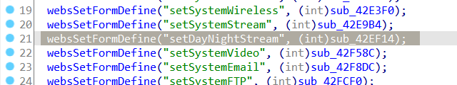
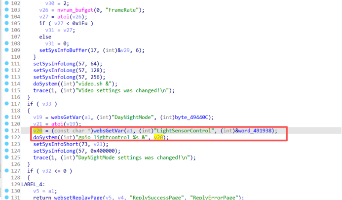

# CVE-2026-36983

# 概要

- **Brief Description of Vulnerability**: The D-Link DCS-932L is a network surveillance camera manufactured by D-Link Corporation (China) used for security and monitoring purposes. A command injection vulnerability exists in the `sub_42EF14` function within the binary program `alphapd`, allowing a remote attacker with authorized access to submit specially crafted requests to execute arbitrary commands remotely.
- **Vulnerable Endpoint URL**: `/setDayNightStream`
- **Manufacturer Website**: https://www.dlink.com/
- **Firmware Download**: https://legacyfiles.us.dlink.com/DCS-932L/REVB/FIRMWARE/DCS-932L_REVB_FIRMWARE_2.18.01.zip

# Affected Versions

- **Affected Version**: V2.18.01

# Vulnerability Details

In the `sub_42EF14` function of the `alphapd` program, the application directly reads the user-supplied `LightSensorControl` parameter and concatenates it into the string `gpio lightcontrol %s &`, resulting in a command injection vulnerability.

